## Running the code

Make sure you have the latest version of the code and filled in the .env file.

```sh
yarn install
yarn dev
```

.env example:

- PORT
- MONGOOSE_URI
- ACCESS_TOKEN_EXPIRY
- ACCESS_TOKEN_SECRET
- SPHERE_ENGINE_PROBLEM_TOKEN
- SPHERE_ENGINE_PROBLEM_URL
- SES_ACCESS_KEY
- SES_SECRET_ACCESS_KEY

## DEPLOYED CODE

The API is hosted at [https://comet-labs-test.onrender.com](https://comet-labs-test.onrender.com)

### ADMIN LOGIN

- email- newuser1@gmail.com
- password- abcd1245

## Features

- [Signup](#Signup)
- [Login](#Login)
- [Logout](#Logout)
- [All Questions](#All-Questions)
- [All Added Questions](#All-Added-Questions)
- [Add Questions](#Add-Questions)
- [Update Questions](#Update-Questions)
- [Add Test Cases](#Add-Test-Cases)
- [Update Testcase](#Update-Test-Cases)
- [All Test Cases](#List-Test-Cases)
- [Edit Test Cases](#Edit-Test-Cases)
- [Create Submisions](#Create-Submision)

<a id="Signup"></a>

### Signup

route - [/user/signup](https://comet-labs-test.onrender.com/user/signup)

Request:

- POST

Parameters:

- name
- email
- password

Returns:

- accesstoken
- email

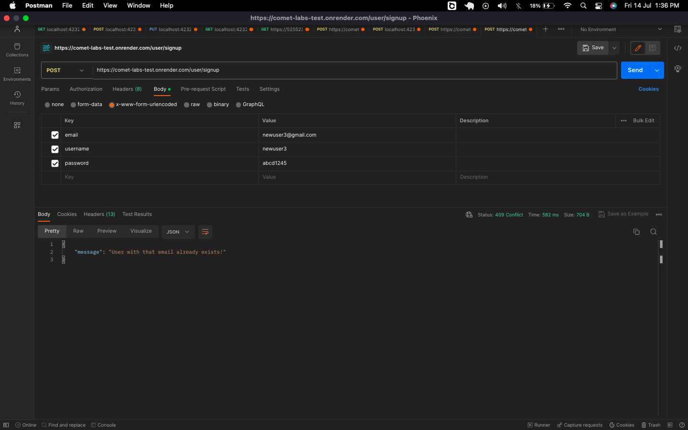
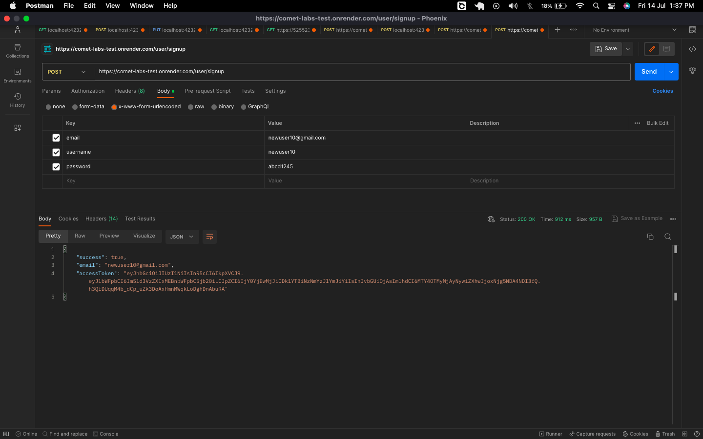

<a id="Login"></a>

### Login

route - [/user/login](https://comet-labs-test.onrender.com/user/login)

Request:

- POST

Parameters:

- email
- password

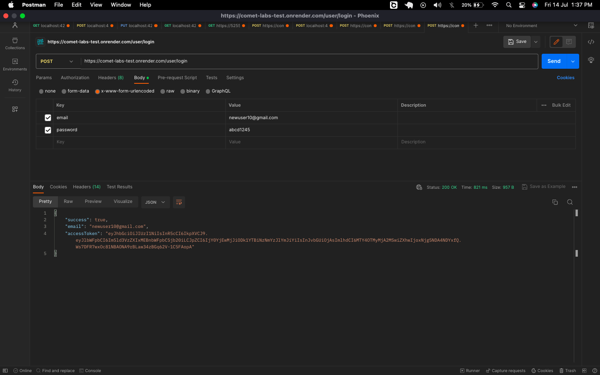

<a id="All-Questions"></a>

### All Questions

route - [/problem/allQuestions](https://comet-labs-test.onrender.com/problem/allQuestions)

Request:

- GET

Returns:

- List of problems from Sphere Engine API

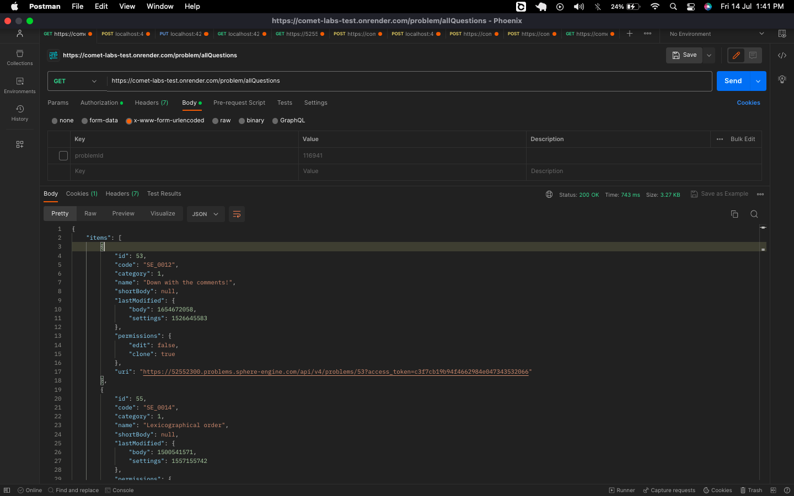

<a id="All-Added-Questions"></a>

### All Added Questions

route - [/problem/addedQuestion](https://comet-labs-test.onrender.com/problem/addedQuestion)

Questions added by admin

Request:

- GET

Parameters:

- NONE

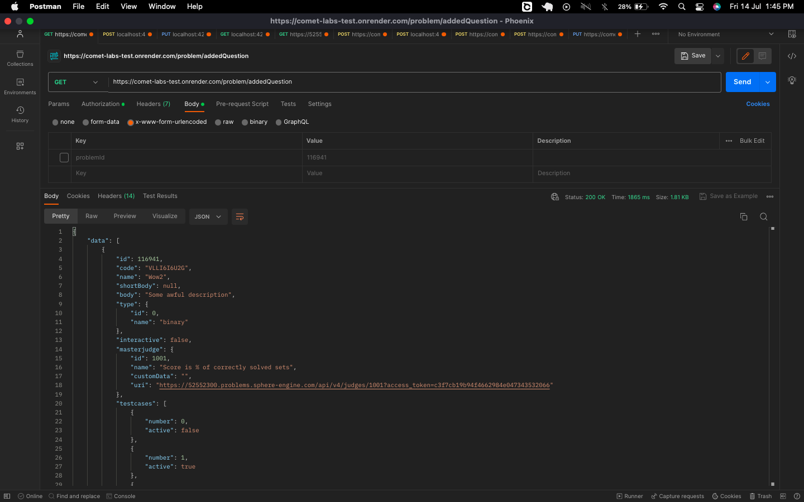

<a id="Add-Questions"></a>

### Add Questions

route - [/addQuestion](https://comet-labs-test.onrender.com/problem/addQuestion)

Request:

- POST

Parameters:

- name
- description
- masterJudgeId

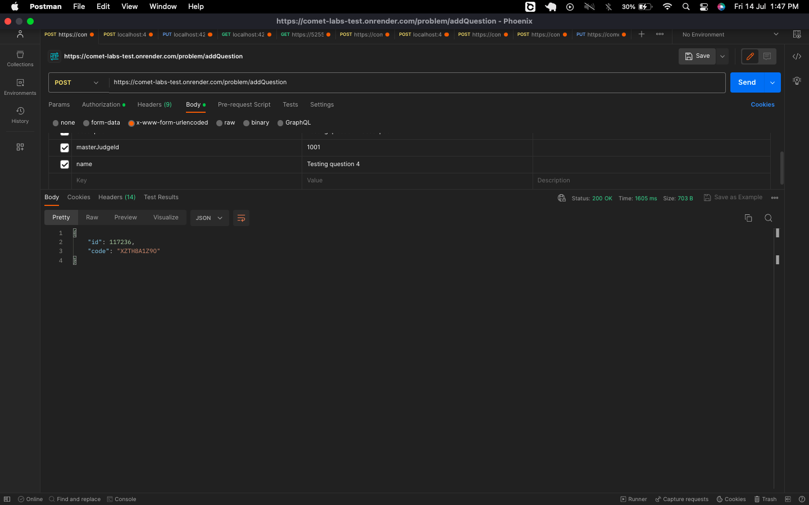

<a id="Update-Questions"></a>

### Update Questions

route - [/question](https://comet-labs-test.onrender.com/problem/question/)

Request:

- PUT

Parameters:

- problemId\*
- name\*
- body\*

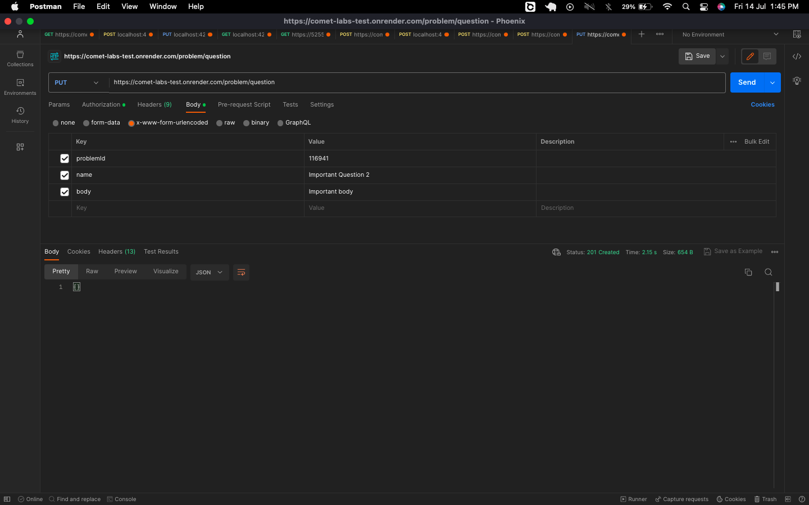

<a id="Add-Test-Cases"></a>

### Add Test Cases

route - [/test/](https://comet-labs-test.onrender.com/testcase)

Request:

- PUT

Parameters:

- problemId\*
- judgeId\*
- input
- output
- active
- timeLimit

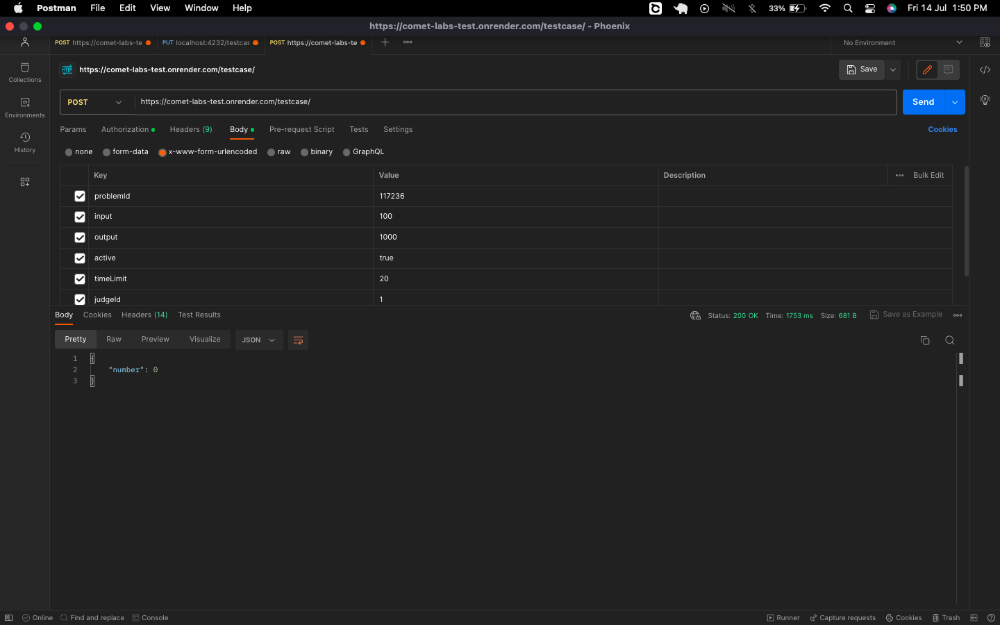

<a id="Update-Test-Cases"></a>

### Update Test Cases

route - [/updateTestCase](https://comet-labs-test.onrender.com/testcase)

updateTestCase takes a POST request with id of the question, input, output, number of test case as the input

Request:

- PUT

Parameters:

- problemId\*
- number\* (test case number)
- input
- output
- active
- timeLimit

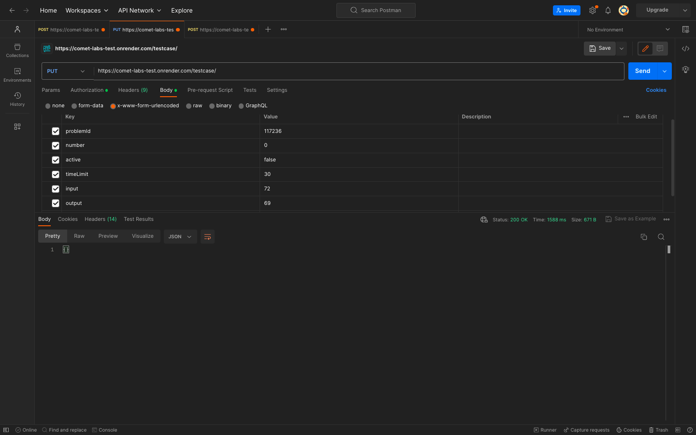

<a id="List-Test-Cases"></a>

### List Test Cases

route - [/testcase/all](https://comet-labs-test.onrender.com/testcase/all)

Request:

- POST

Parameters:

- problemId\*

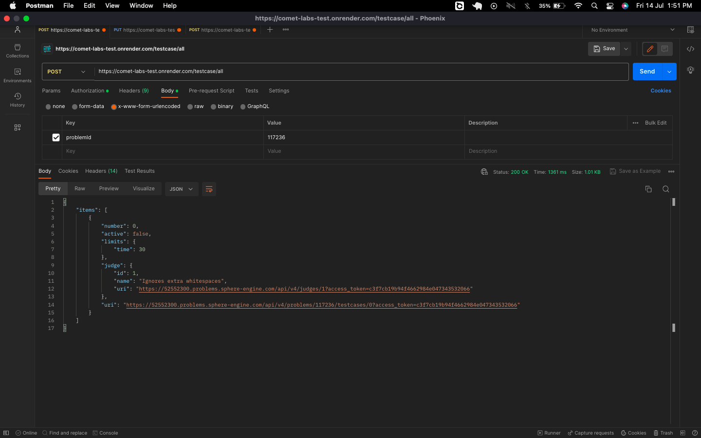

<a id="List-All-Submissions"></a>

### List All Submissions

route - [/submission](https://comet-labs-test.onrender.com/listAllSubmissions)

Request:

- GET

Parameters:

- NONE

<a id="Create-Submission"></a>

### Create submission

route - [/submission](https://comet-labs-test.onrender.com/submission)

Request:

- POST

Parameters:

- problemId\*
- compilerId\*
- source\*
- compilerVersionId

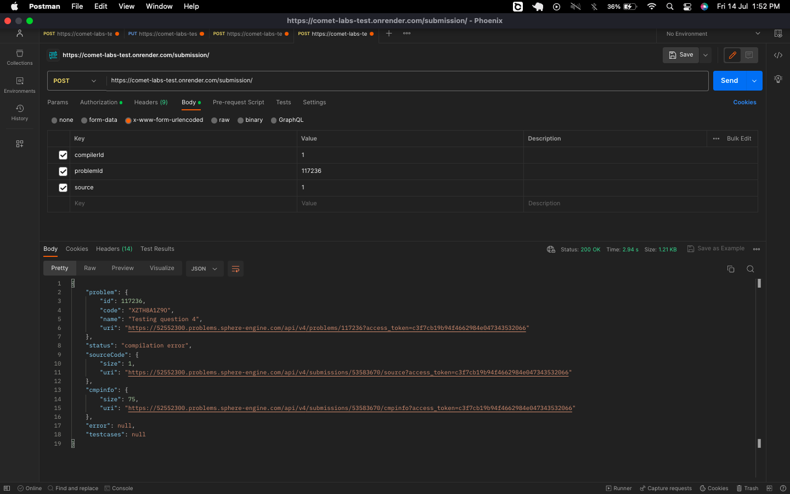

#### Submission Result Mail

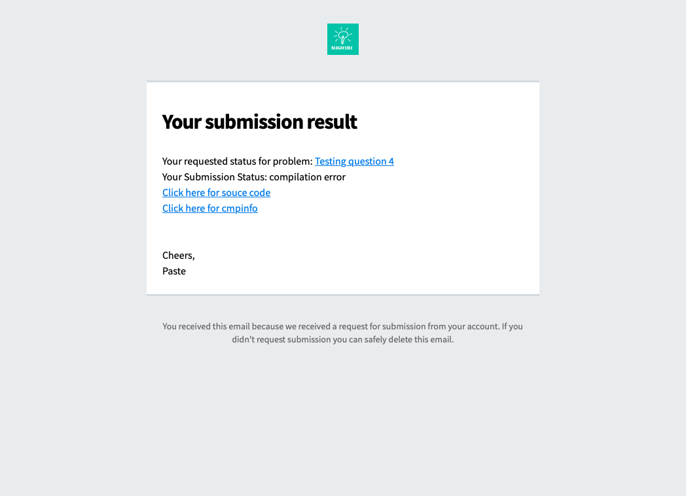
